# Report for Assignment 1

## Project chosen

Name: reader

URL: https://github.com/lemon24/reader

Number of lines of code and the tool used to count it: KLOC: 27.236 | tool: lizard

Programming language: python

## Coverage measurement

### Existing tool

<Inform the name of the existing tool that was executed and how it was executed>
Tool: tox + coverage.py  
Usage: The tool was used by following the guide on the contribute page of the project. We set up the development environment and run "tox" command, which run the full test suite using coverage.py. We found the result under "htmlcov/index.html" file name, which generated a file with the coverage (it can also be found in the terminal, however the html file is easier to read).

<Show the coverage results provided by the existing tool with a screenshot>
  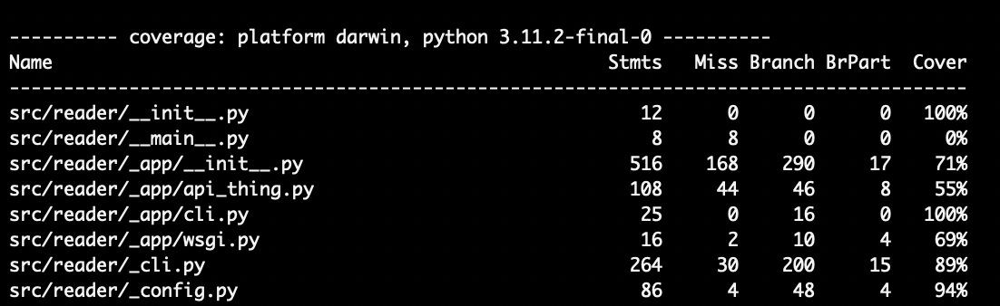
  (tests in between that were skipped in the screenshots)
  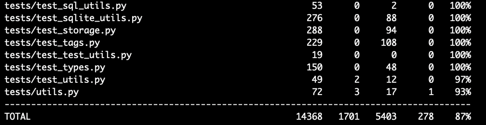

### Your own coverage tool

<The following is supposed to be repeated for each group member>

Group 69 - Yves Mangano  
Function 1 - _is_base64

https://github.com/KubaDomagala/reader/commit/92fcd2ff30c1292d1ed557ab4cf23a8ea9cd9fc6#diff-0b5c7ce5afcc43bab73a6f39f273da57a5f004f1a89da9c8361a84442ee0217d

And

https://github.com/KubaDomagala/reader/commit/d77e6039e13b0425a36f6e1117c047700779896d

<Provide a screenshot of the coverage results output by the instrumentation>

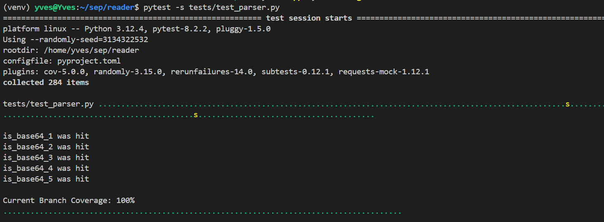

The coverage tool can be run by using pytest -s tests/test_parser.py
Please note that when the coverage tool is ran with print_coverage_map_content_type()
not being commented out, the results of the base_64 branch coverage tool will be displayed somewhere
in the middle so it might be a little bit hard to find. However, it will show the
exact same output.

Function 2 - map_content_type

<Show a patch (diff) or a link to a commit made in your forked repository that shows the instrumented code to gather coverage measurements>

https://github.com/KubaDomagala/reader/commit/92fcd2ff30c1292d1ed557ab4cf23a8ea9cd9fc6#diff-0b5c7ce5afcc43bab73a6f39f273da57a5f004f1a89da9c8361a84442ee0217d

And

https://github.com/KubaDomagala/reader/commit/d77e6039e13b0425a36f6e1117c047700779896d

<Provide a screenshot of the coverage results output by the instrumentation>

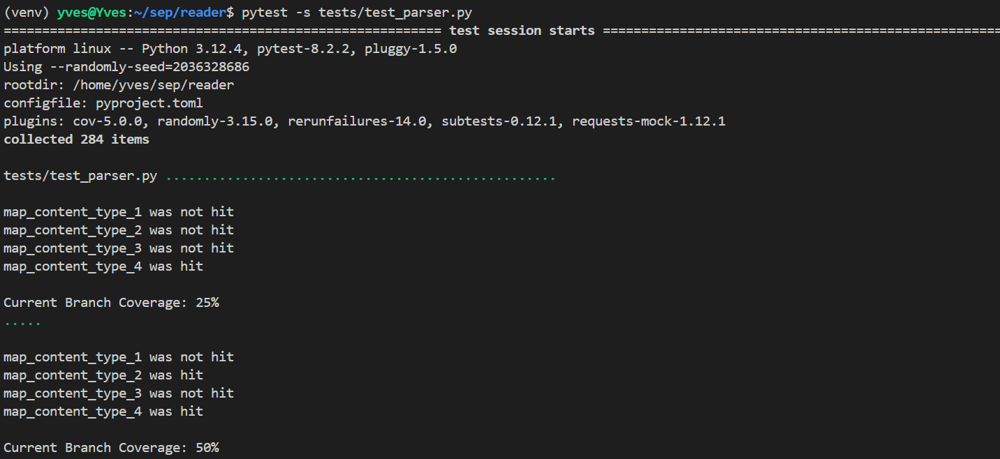

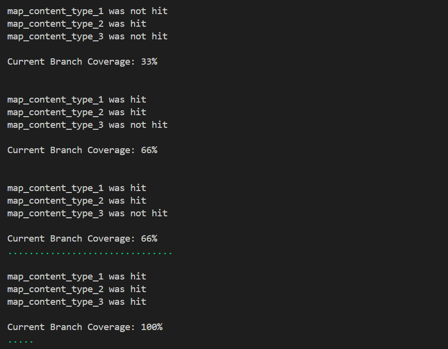

The coverage tool can be run by using pytest -s tests/test_parser.py

Group 69 - Caio Miranda Haschelevici  
Function 1 - hungarian.py

   <Original cover results:>
   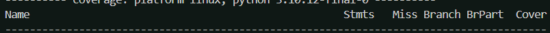
   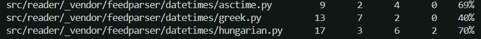

   <Original code:>
   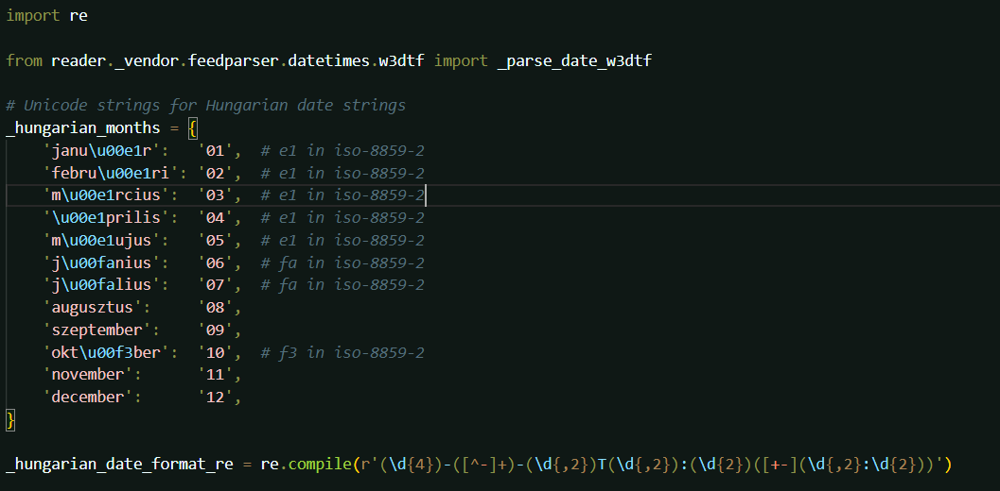
   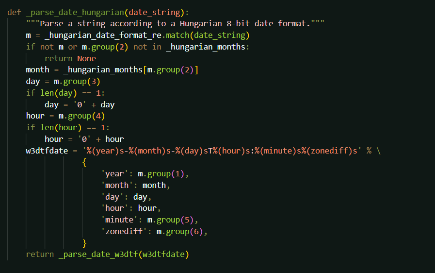
     
   <Changed code to make coverage tool>
   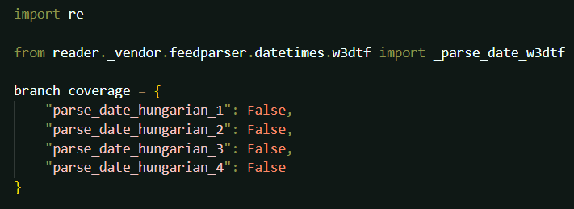
   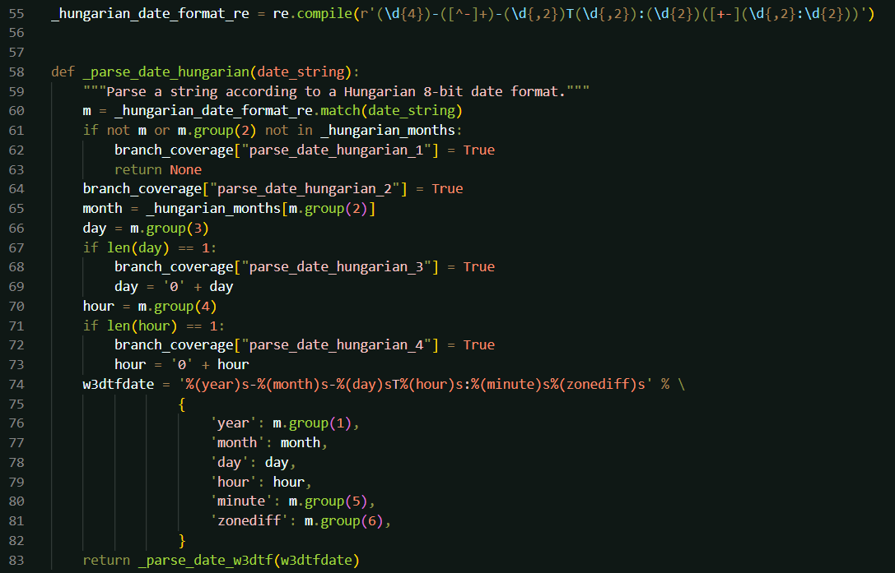
   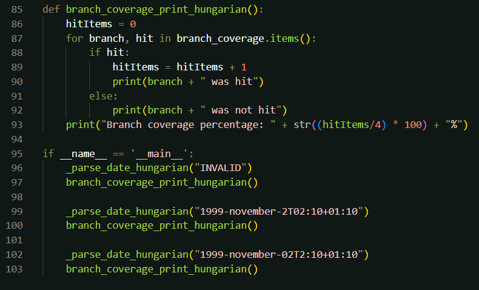

   <Own coverage tool results with own tests:>
   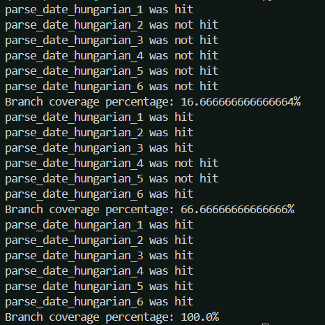

Function 2 - asctime.py

   <Original cover results:>
   
   

   <Original code:>
   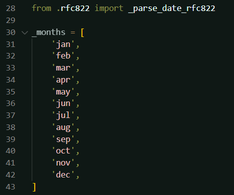
   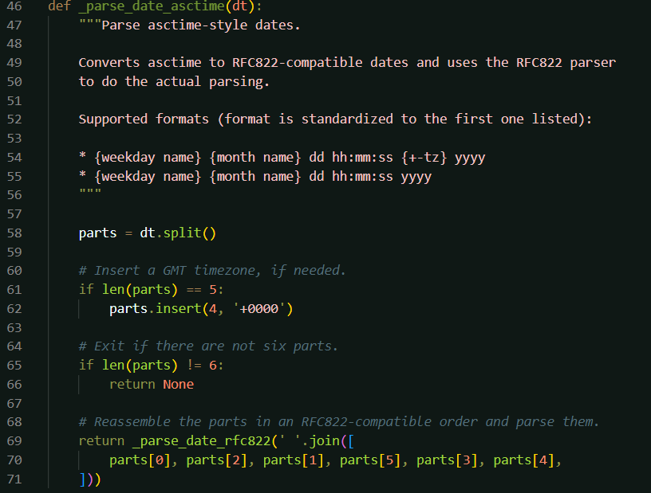

   <Changed code to make coverage tool>
   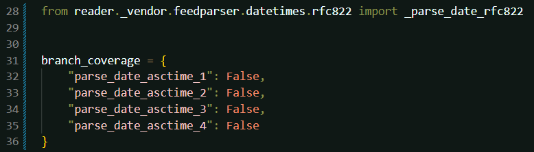
   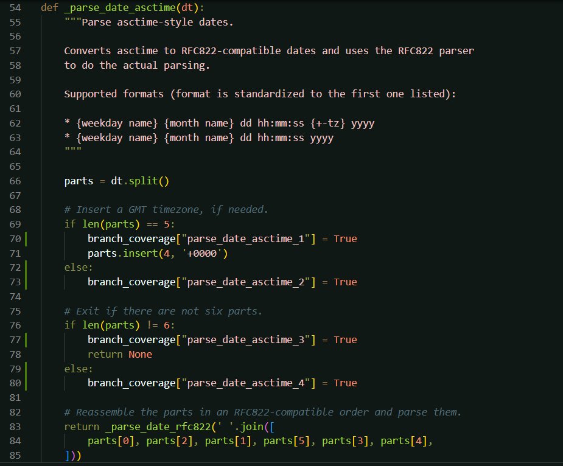
   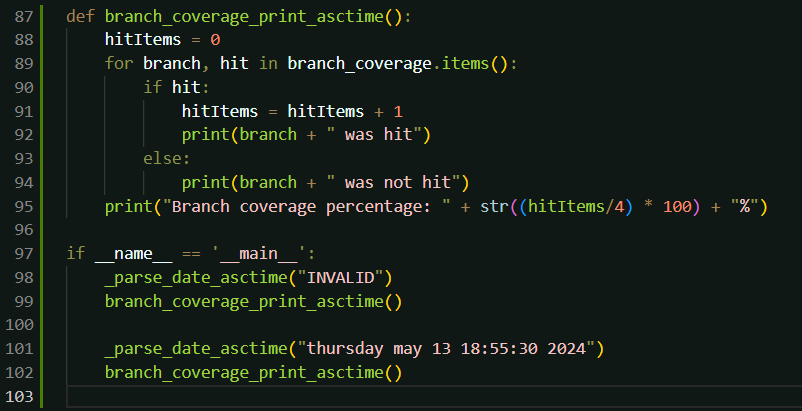

   <Own coverage tool results with own tests:>
   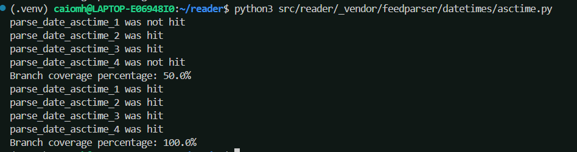

## Coverage improvement

### Individual tests

<The following is supposed to be repeated for each group member>

Group 69 - Yves Mangano  
Test 1
  
https://github.com/KubaDomagala/reader/commit/92fcd2ff30c1292d1ed557ab4cf23a8ea9cd9fc6#diff-237d6caeea59e3cf8f303958b4b29e752861048496a047a6af38a12915a02e32

<Provide a screenshot of the old coverage results (the same as you already showed above)>

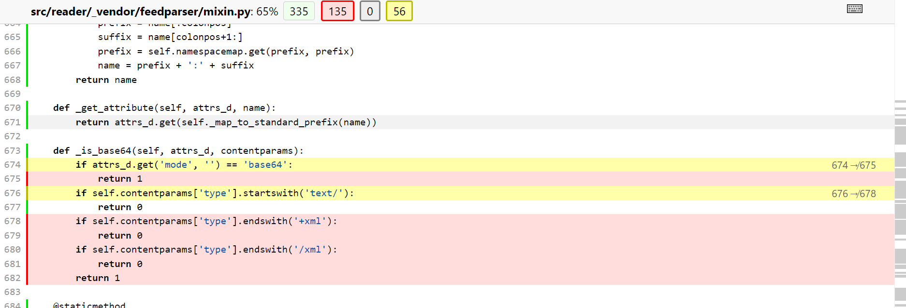

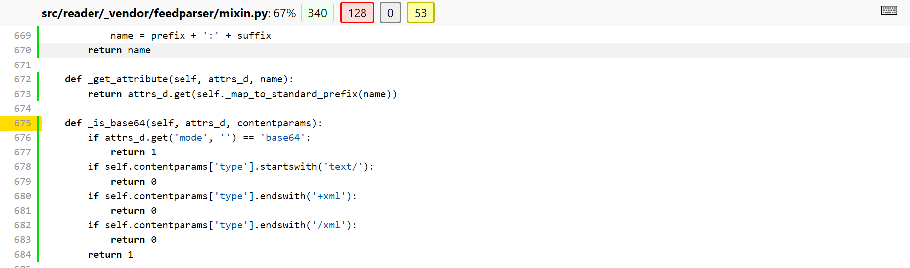
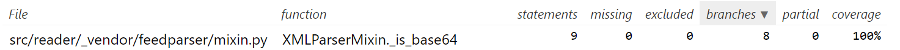

<State the coverage improvement with a number and elaborate on why the coverage is improved>

The coverage for function _is_base64 improved from 0% to 100%. This is because
there were simply no tests made for _is_base64, causing in a branch coverage of 0%.
However, since I have added tests to make sure each branch condition is tested
and accessed, the branch condition went up to 100%. 

Test 2

<Show a patch (diff) or a link to a commit made in your forked repository that shows the new/enhanced test>

https://github.com/KubaDomagala/reader/commit/92fcd2ff30c1292d1ed557ab4cf23a8ea9cd9fc6#diff-237d6caeea59e3cf8f303958b4b29e752861048496a047a6af38a12915a02e32

<Provide a screenshot of the old coverage results (the same as you already showed above)>

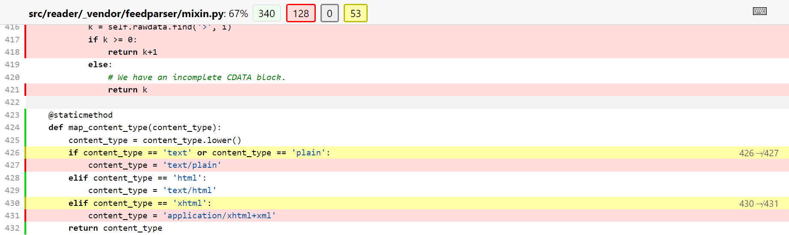

<Provide a screenshot of the new coverage results>

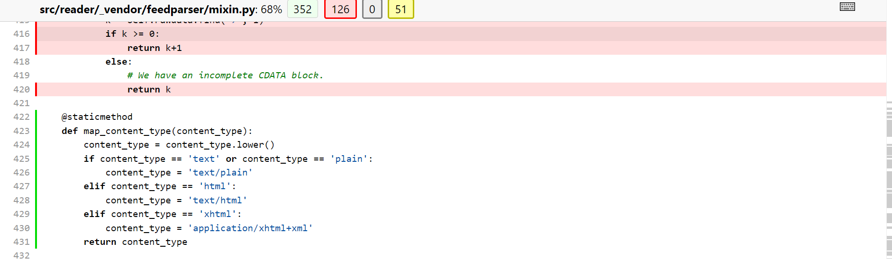
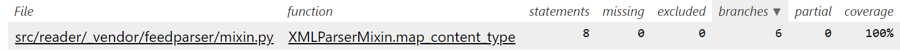

<State the coverage improvement with a number and elaborate on why the coverage is improved>

The coverage for function map_content_type improved from 0% to 100%. This is because
there were simply no tests made for map_content_type, causing in a branch coverage of 0%.
However, since I have added tests to make sure each branch condition is tested
and accessed, the branch condition went up to 100%. 
<Provide a screenshot of the new coverage results>

Caio Miranda Haschelevici  
Test 1 - hungarian.py

   <Original cover results:>
   
   

   <New tests:>
   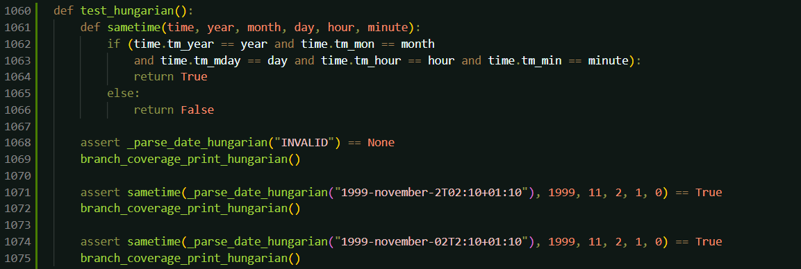
   <New covarage results:>
   
   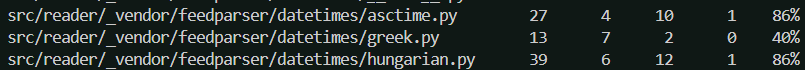

Overall we saw an improvement in coverage of 16% the main reason from this can be found when looking at the initial report generated by the coverage tool used. From what it shows the main reason for this low coverage where that the tests used always made the conditions on the if statement always true or false. Therefore, coverage wasnt very high due to the branch conditions not being checked by any individual test. My test checks each branch condition when its true or false thus determining if the branches would work properly during operation. Thus, increasing the coverage by 16%. It is also important to note that the functions coverage didnt increase further due to the inclusion of my own coverage tool into the function. The inclusion of this tool into the function itself caused alot of statements to go unused as they are exclusive statements to my own coverage tool. For example the area with tests for my own coverage tool.
     
Test 2 - asctime.py
   <Original cover results:>
   
   

   <New tests:>
   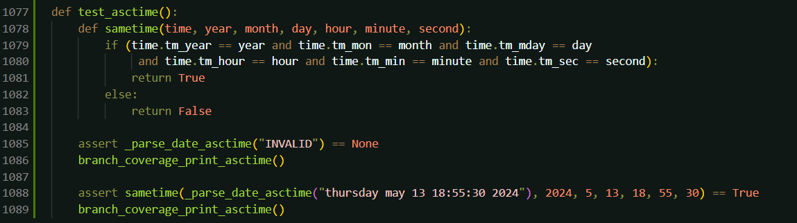

   <New covarage results:>
   
   

   Overall we saw an improvement in coverage of 17%, we saw this improvements because of a similar reason as the previous test. Just like in the previous case we had a low initial coverage because certain branches where either always true or always false with the pre-exisiting tests. However, the tests I added ensure that either case of every branch is tested and therefore we had an increase in the overall coverage of this function by 17%. Just like in the rpevious test case, it is important to note that due to the inclusion of my own coverage tool into the function, the coverage wasnt able to be higher. This is due to the fact that certain areas of the code where exclusive to my coverage tool and therefore not tested. Thus, hampering the overall coverage

### Overall

<Provide a screenshot of the old coverage results by running an existing tool (the same as you already showed above)>

<Provide a screenshot of the new coverage results by running the existing tool using all test modifications made by the group>

## Statement of individual contributions

<Write what each group member did>

Group 69 - Yves Mangano

I worked on the functions _is_base64 and map_content_type. I made my own coverage
tool where the branch coverage can be shown by running pytest -s tests/test_parser.py

I increased the branch coverage from 0% to 100% in these functions, enhancing 
the overall coverage of the project, by creating my own tests in test_parser.py
making sure that each branch is accessed and functions correctly by using 
assert statements inside of the tests.

I've contributed also in our team by helping understand how the project works
and how we can run the inbuilt coverage (coverage.py) not only by using "tox" but
also "./run.sh coverage-all", and I've provided an example of the tests I've made 
for my teammates to help understand how they can test their functions.
Especially since _is_base64 function is a method from a class, it is harder to test, 
but I managed how to and set an example for the group doing this.
