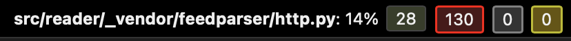

# Report for Assignment 1

## Project chosen

Name: reader

URL: https://github.com/lemon24/reader

Number of lines of code and the tool used to count it: KLOC: 27.236 | tool: lizard

Programming language: python

## Coverage measurement

### Existing tool

<Inform the name of the existing tool that was executed and how it was executed>
Tool: tox + coverage.py  
Usage: The tool was used by following the guide on the contribute page of the project. We set up the development environment and run "tox" command, which run the full test suite using coverage.py. We found the result under "htmlcov/index.html" file name, which generated a file with the coverage (it can also be found in the terminal, however the html file is easier to read).

<Show the coverage results provided by the existing tool with a screenshot>
  
  (tests in between that were skipped in the screenshots)
  

### Your own coverage tool

<The following is supposed to be repeated for each group member>

Group 69 - Kuba Domagala  
Function 1 - _build_urilib2_request

<Show a patch (diff) or a link to a commit made in your forked repository that shows the instrumented code to gather coverage measurements>
Link to the commit with the changed code of the function(_vendor/feedparser/http.py file) - https://github.com/KubaDomagala/reader/commit/108385f001ee1d6462d8b52357b04410e9d40a48#diff-c55ed7a611ef230781c2cab96ac3fb2fba6468e7b2e92d0a9abe2b49f6ebaf08
(The results can also be seen in the commit in the file "_build_urllib2_request_coverage.txt" )
Link to the update of the modification - https://github.com/KubaDomagala/reader/commit/ad3b7296bda99e7e16bd29c0651d3bcb7fd29aa7

CODE (BEFORE):
  

CODE (AFTER):  
  

  

<Provide a screenshot of the coverage results output by the instrumentation>
RESULTS (BEFORE):
  

RESULTS (FINAL, full results can be seen in a file "_build_urllib2_request_coverage.txt")  
  

Function 2 - setup_logging

<Provide the same kind of information provided for Function 1>
Link to the 1st commit with the coverage changes - https://github.com/KubaDomagala/reader/commit/189b4a84e784f5feb72056ff9b0a6b2cace8c683 (in the file "src/reader_cli.py")
2nd part of the coverage changes - https://github.com/KubaDomagala/reader/commit/108385f001ee1d6462d8b52357b04410e9d40a48#diff-ae4c294e1304214c4dc7860dfb07bbf702d59f952cf157ea705cf22b1e134244 (in the file in the file "src/reader_cli.py")

CODE (BEFORE):
  

  

CODE (AFTER):
  

  

RESULTS (BEFORE):  
  

RESULTS (FINAL, full results can be seen in a file "setup_logging_coverage.txt
" + the initial results differ from the screenshot as the tests have been rerun in the different order producing a different initial coverage, which was always < 80%)  
  

## Coverage improvement

### Individual tests

<The following is supposed to be repeated for each group member>

Kuba Domagala  
Test 1 - _build_urilib2_request

<Show a patch (diff) or a link to a commit made in your forked repository that shows the new/enhanced test>
Link to the commit with added tests - https://github.com/KubaDomagala/reader/commit/108385f001ee1d6462d8b52357b04410e9d40a48#diff-371d71686903901ab120e582d2ca811179700201f7652353fdc03bc9f0fb9240 (in the file "tests/test_reader__vendor_feedparser_urls.py", function "test_build_urllib2_request()")

<Provide a screenshot of the old coverage results (the same as you already showed above)>
BEFORE (function itself):
  

(function coverage %)
  

(file coverage %)  
  

<Provide a screenshot of the new coverage results>
AFTER (function itself):
  

(function coverage %)
  

(file coverage %)
  

<State the coverage improvement with a number and elaborate on why the coverage is improved>
The coverage of the function has improved from 0% to 100% in both code and branch coverage. This is because no tests have existed for that specific function and no already existing test used the functionality of that function. The coverage has improved as I added extensive tests that check every branch for that function that have not existed before.

Test 2 - setup_logging

Link to the commit with added tests https://github.com/KubaDomagala/reader/commit/189b4a84e784f5feb72056ff9b0a6b2cace8c683#diff-4e8715c7a425ee52e74b7df4d34efd32e8c92f3e60bd51bc2e1ad5943b82032e (in the file "tests/test_cli.py" function "test_cli_setup_logging") + modification here (same file and function) - https://github.com/KubaDomagala/reader/commit/108385f001ee1d6462d8b52357b04410e9d40a48#diff-4e8715c7a425ee52e74b7df4d34efd32e8c92f3e60bd51bc2e1ad5943b82032e

<Provide the same kind of information provided for Test 1>
BEFORE (function ifself:)
  

(function coverage %)
  

(file coverage %)  
  

<Provide a screenshot of the new coverage results>
  AFTER (function itself):
  

(function coverage %)
  

(file coverage %)  
  

The coverage of the function has improved from 60% to 100% (branch coverage) and from 65% to 100% (code coverage)

### Overall

<Provide a screenshot of the old coverage results by running an existing tool (the same as you already showed above)>

<Provide a screenshot of the new coverage results by running the existing tool using all test modifications made by the group>

## Statement of individual contributions

<Write what each group member did>
Kuba Domagala
I worked on the functions _build_urilib2_request and setup_logging. I made my own coverage tool where the branch coverage can be shown by opening the respective files created in the main root of the project (first entry is the before the added tests, everything else is after).

I increased the coverage of these functions to 100% in their respective files, enhancing the coverage of the project and making sure that all of the branches are accessed and their results are as expected.

Additionally I was responsible for merging all of the pull requests and general organisation of the work. I was the one who found the repository that we are using in the assingment and made sure that everyone was able to run things correctly, so that we could start working.
