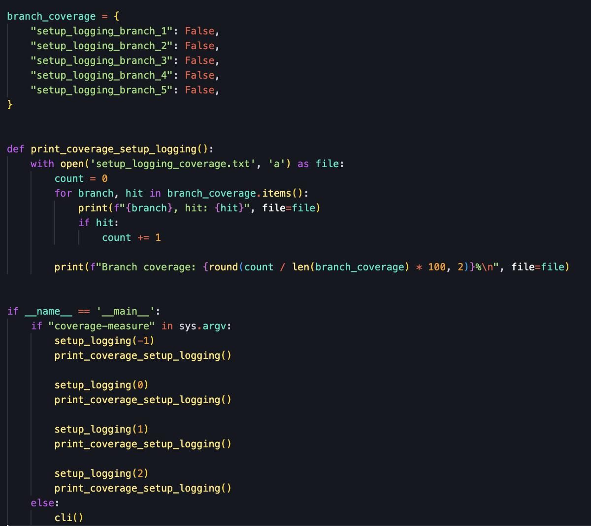
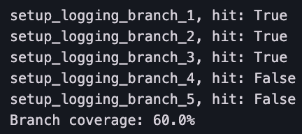
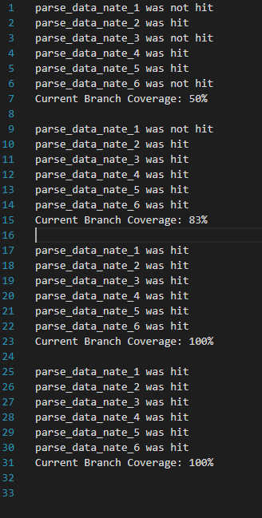
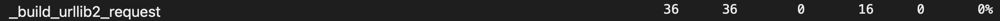

# Report for Assignment 1

## Project chosen

Name: reader

URL: https://github.com/lemon24/reader

Number of lines of code and the tool used to count it: KLOC: 27.236 | tool: lizard

Programming language: python

## Coverage measurement

### Existing tool

Tool: tox + coverage.py  
Usage: The tool was used by following the guide on the contribute page of the project. We set up the development environment and run "tox" command, which run the full test suite using coverage.py. We found the result under "htmlcov/index.html" file name, which generated a file with the coverage (it can also be found in the terminal, however the html file is easier to read).

<Show the coverage results provided by the existing tool with a screenshot>
  
  (tests in between that were skipped in the screenshots)
  

### Your own coverage tool

#### Yves Mangano  
##### Function 1 - _is_base64

https://github.com/KubaDomagala/reader/commit/92fcd2ff30c1292d1ed557ab4cf23a8ea9cd9fc6#diff-0b5c7ce5afcc43bab73a6f39f273da57a5f004f1a89da9c8361a84442ee0217d

And

https://github.com/KubaDomagala/reader/commit/d77e6039e13b0425a36f6e1117c047700779896d

<Provide a screenshot of the coverage results output by the instrumentation>

The coverage tool can be run by using pytest -s tests/test_parser.py
Please note that when the coverage tool is ran with print_coverage_map_content_type()
not being commented out, the results of the base_64 branch coverage tool will be displayed somewhere
in the middle so it might be a little bit hard to find. However, it will show the
exact same output.

---

##### Function 2 - map_content_type
https://github.com/KubaDomagala/reader/commit/92fcd2ff30c1292d1ed557ab4cf23a8ea9cd9fc6#diff-0b5c7ce5afcc43bab73a6f39f273da57a5f004f1a89da9c8361a84442ee0217d

And

https://github.com/KubaDomagala/reader/commit/d77e6039e13b0425a36f6e1117c047700779896d
  

The coverage tool can be run by using pytest -s tests/test_parser.py

---

#### Caio Miranda Haschelevici  
##### Function 1 - _parse_date_hungarian

   Original cover results:    
   

   Original code:  
   
   
     
   Changed code to make coverage tool:  
   
   
   

   Own coverage tool results after making own tests:  
       
   Due to the 0% stateent coverage and the fact no exisiting tests called this function. The code produced no results and thus had a branch coverage of 0% before the new tests were added.

   How to run:  
   Coverage tool can be run by using pytest tests/test_parser.py or even the tox command. Results of the branch coverage will be placed in the CoverageHun.txt file. 

--- 
##### Function 2 - _parse_date_asctime

   Original cover results:    
   

   Original code:  
       
   
     
   Changed code to make coverage tool:  
   
   
   

   Own coverage tool results after making own tests:  
       
   Due to the 0% stateent coverage and the fact no exisiting tests called this function. The code produced no results and thus had a branch coverage of 0% before the new tests were added.

   How to run:  
   Coverage tool can be run by using pytest tests/test_parser.py or even the tox command. Results of the branch coverage will be placed in the CoverageAsc.txt file. 

---

#### Kuba Domagala  
##### Function 1 - _build_urilib2_request
  
1. Link to the commit with the changed code of the function(_vendor/feedparser/http.py file) - https://github.com/KubaDomagala/reader/commit/108385f001ee1d6462d8b52357b04410e9d40a48#diff-c55ed7a611ef230781c2cab96ac3fb2fba6468e7b2e92d0a9abe2b49f6ebaf08
(The results can also be seen in the commit in the file "_build_urllib2_request_coverage.txt" )
2. Link to the update of the modification - https://github.com/KubaDomagala/reader/commit/ad3b7296bda99e7e16bd29c0651d3bcb7fd29aa7
3. final modification - https://github.com/KubaDomagala/reader/commit/7fe5a9b8be8e353bc25dcc600541f8593a8535cb#diff-ae4c294e1304214c4dc7860dfb07bbf702d59f952cf157ea705cf22b1e134244

CODE (BEFORE):
  

CODE (AFTER):  
  

  

<Provide a screenshot of the coverage results output by the instrumentation>
RESULTS (BEFORE):
  

RESULTS (FINAL, full results can be seen in a file "_build_urllib2_request_coverage.txt")  
  

---

##### Function 2 - setup_logging

1. Link to the 1st commit with the coverage changes - https://github.com/KubaDomagala/reader/commit/189b4a84e784f5feb72056ff9b0a6b2cace8c683 (in the file "src/reader_cli.py")
2. 2nd part of the coverage changes - https://github.com/KubaDomagala/reader/commit/108385f001ee1d6462d8b52357b04410e9d40a48#diff-ae4c294e1304214c4dc7860dfb07bbf702d59f952cf157ea705cf22b1e134244 (in the file in the file "src/reader_cli.py")
3. final modification - https://github.com/KubaDomagala/reader/commit/7fe5a9b8be8e353bc25dcc600541f8593a8535cb#diff-ae4c294e1304214c4dc7860dfb07bbf702d59f952cf157ea705cf22b1e134244

CODE (BEFORE):
  

  

CODE (AFTER):
  

  

RESULTS (BEFORE):  
  

RESULTS (FINAL, full results can be seen in a file "setup_logging_coverage.txt
" + the initial results differ from the screenshot as the tests have been rerun in the different order producing a different initial coverage, which was always < 80%)  
  

---

#### Sheng-Wen Chen 
##### Function 1 - _parse_poslist()  

My commitment can be found by clicking this link:
https://github.com/KubaDomagala/reader/commit/ed1d0cf4e1849477d5700d74490750b2d60dd15d

The coverage tool for _parse_poslist() is written under the file [src/reader/_vendor/feedparser/namespaces/georss.py](https://github.com/KubaDomagala/reader/blob/coverage-improv-1/src/reader/_vendor/feedparser/namespaces/georss.py), same location of where _parse_poslist() exists in. To run this, simply run the georss.py file from the terminal with the command <code>python3 ./src/reader/_vendor/feedparser/namespaces/georss.py</code>. As it can be seen with my own coverage tool, all of the branches in _parse_poslist() were hit, leading to a coverage percentage of 100%. 

---

##### Function 2 - _parse_date_nate()  

My commitment can be found by clicking this link:
https://github.com/KubaDomagala/reader/commit/a89c04e040ff6391efdc5a9db8f64e37fcaadd3e

The coverage tool for _parse_date_nate() is written under the file [src/reader/_vendor/feedparser/datetimes/korean.py](https://github.com/KubaDomagala/reader/blob/coverage-improv-1/src/reader/_vendor/feedparser/datetimes/korean.py), same location of where _parse_date_nate() exists in. To run this, simply run the korean.py file from the terminal with the command <code>python3 src/reader/_vendor/feedparser/datetimes/korean.py</code>. As it can be seen with my own coverage tool, all of the branches in _parse_date_nate() were hit, leading to a coverage percentage of 100%. 

## Coverage improvement

### Individual tests

#### Yves Mangano  
##### Test 1
  
https://github.com/KubaDomagala/reader/commit/92fcd2ff30c1292d1ed557ab4cf23a8ea9cd9fc6#diff-237d6caeea59e3cf8f303958b4b29e752861048496a047a6af38a12915a02e32

The coverage for function _is_base64 improved from 0% to 100%. This is because
there were simply no tests made for _is_base64, causing in a branch coverage of 0%.
However, since I have added tests to make sure each branch condition is tested
and accessed, the branch condition went up to 100%. 

---

##### Test 2
https://github.com/KubaDomagala/reader/commit/92fcd2ff30c1292d1ed557ab4cf23a8ea9cd9fc6#diff-237d6caeea59e3cf8f303958b4b29e752861048496a047a6af38a12915a02e32

The coverage for function map_content_type improved from 0% to 100%. This is because
there were simply no tests made for map_content_type, causing in a branch coverage of 0%.
However, since I have added tests to make sure each branch condition is tested
and accessed, the branch condition went up to 100%. 

---

#### Caio Miranda Haschelevici  
##### Test 1 - _parse_date_hungarian

   Original cover results:  
   
   
   

   New tests:  
   
   
   New covarage results:  
   
   

As can be seen by the change of result from the tox test we can see we have raised our coverage from 0% to 100% in both branch and statement coverage. This is because before hand there where no tests for this function and by adding them and addressing each indivudal branch we are able to cover every statement and branch. Thus, by combining the change in result of our own coverage test and those of the included one we have seen an increase to 100% of both branch and statement coverage.

---

##### Test 2 - _parse_date_asctime

   Original cover results:  
   
   
   

   New tests:  
   
   
   New covarage results:  
   
   

Just like the previous function we have seen a raise of 100% on both the branch and statement coverage of this function. Just like the previous case this is because there included tests didnt cover it at all. Therefore, by adding the appropriate tests we are abler to increase both its branch and statement coverage. by combining the results of our own coverage tool and those of the included one we can clearly see and increase to 100% on the branch and statement coverage for this function.

---

#### Kuba Domagala  
##### Test 1 - _build_urilib2_request
  
1. Link to the commit with added tests - https://github.com/KubaDomagala/reader/commit/108385f001ee1d6462d8b52357b04410e9d40a48#diff-371d71686903901ab120e582d2ca811179700201f7652353fdc03bc9f0fb9240 (in the file "tests/test_reader__vendor_feedparser_urls.py", function "test_build_urllib2_request()")
2.https://github.com/KubaDomagala/reader/commit/92fcd2ff30c1292d1ed557ab4cf23a8ea9cd9fc6#diff-237d6caeea59e3cf8f303958b4b29e752861048496a047a6af38a12915a02e32

BEFORE (function itself):
  

(function coverage %)
  

(file coverage %)  
  

AFTER (function itself):
  

(function coverage %)
  

(file coverage %)
  

The coverage of the function has improved from 0% to 100% in both code and branch coverage. This is because no tests have existed for that specific function and no already existing test used the functionality of that function. The coverage has improved as I added extensive tests that check every branch for that function that have not existed before.

---

##### Test 2 - setup_logging
1. Link to the commit with added tests https://github.com/KubaDomagala/reader/commit/189b4a84e784f5feb72056ff9b0a6b2cace8c683#diff-4e8715c7a425ee52e74b7df4d34efd32e8c92f3e60bd51bc2e1ad5943b82032e (in the file "tests/test_cli.py" function "test_cli_setup_logging")
2. modification here (same file and function) - https://github.com/KubaDomagala/reader/commit/108385f001ee1d6462d8b52357b04410e9d40a48#diff-4e8715c7a425ee52e74b7df4d34efd32e8c92f3e60bd51bc2e1ad5943b82032e

BEFORE (function ifself:)
  

(function coverage %)
  

(file coverage %)  
  

<Provide a screenshot of the new coverage results>
  AFTER (function itself):
  

(function coverage %)
  

(file coverage %)  
  

The coverage of the function has improved from 60% to 100% (branch coverage) and from 65% to 100% (code coverage)

---

#### Sheng-Wen Chen 
##### Test 1 georss.py

Overall the coverage percentage increased from 0% t0 100%.
The coverage percentage of _parse_poslist() was initially only 0%, meaing that it wasn't even tested in its original file. After building a tests for _parse_poslist(), all of the branches were hit, and the coverage percentage increased to 100%. 

---

##### Test 2 korean.py

Overall the coverage percentage increased from 0% to 88%.
The coverage percentage of _parse_date_nate() was initially only 0%, meaing that it wasn't even tested in its original file. After building a tests for _parse_date_nate(), all of the branches were hit, and the coverage percentage increased to 88%. 

### Overall

<Provide a screenshot of the old coverage results by running an existing tool (the same as you already showed above)>

<Provide a screenshot of the new coverage results by running the existing tool using all test modifications made by the group>

## Statement of individual contributions

### Yves Mangano

I worked on the functions _is_base64 and map_content_type. I made my own coverage
tool where the branch coverage can be shown by running pytest -s tests/test_parser.py

I increased the branch coverage from 0% to 100% in these functions, enhancing 
the overall coverage of the project, by creating my own tests in test_parser.py
making sure that each branch is accessed and functions correctly by using 
assert statements inside of the tests.

I've contributed also in our team by helping understand how the project works
and how we can run the inbuilt coverage (coverage.py) not only by using "tox" but
also "./run.sh coverage-all", and I've provided an example of the tests I've made 
for my teammates to help understand how they can test their functions.
Especially since _is_base64 function is a method from a class, it is harder to test, 
but I managed how to and set an example for the group doing this.

---

### Caio Miranda Haschelevici
I worked on the functions _parse_date_hungarian and _parse_date_asctime, creating tests to increase there branch and statement coverage from 0% to 100%, as initially therfe where no tests that ran these functions. Not only that, but I made my own coverage tool to test the branch coverages of these functions, it even calculated the branch coverage percentage after every run of the main function. The results of my efforts can be found in the test files coverageAsc and coverageHun respectuflly, as every time my coverage tool runs it writes the results onto these files. Furthermore, I also helped in the beggining in the search for projects proposing a few ideas, that due to being hard to setup, where not taken. I also helped my teammates in properly setting up push requests from there local branches to branches found in the actual repository.

---

### Kuba Domagala
I worked on the functions _build_urilib2_request and setup_logging. I made my own coverage tool where the branch coverage can be shown by opening the respective files created in the main root of the project (first entry is the before the added tests, everything else is after).

I increased the coverage of these functions to 100% in their respective files, enhancing the coverage of the project and making sure that all of the branches are accessed and their results are as expected.

Additionally I was responsible for merging all of the pull requests and general organisation of the work. I was the one who found the repository that we are using in the assingment and made sure that everyone was able to run things correctly, so that we could start working.

---

### Sheng-Wen Chen

I worked on the functions _parse_poslist() and _parse_nate_date(). I made my own coverage tools where the branch coverage can be shown by running the commands <code>python3 ./src/reader/_vendor/feedparser/namespaces/georss.py</code> and <code>python3 src/reader/_vendor/feedparser/datetimes/korean.py</code>.

I increased the branch coverage of _parse_poslist() from 0% to 100%, and the branch coverage of _parse_nate_date() from 0% to 88% enhancing the overall coverage of the project. This was done by creating my own tests in test_parser.py, making sure that each branch is accessed and functions correctly by using assert statements inside of the tests. One of the branche wasn't able to reach after running <code>tox</code>.

Additionally, I was responsible for ensuring the group project was heading in the right direction. For instance, we didn't know that we needed to add an external "else" statement after an "if" statement that did not end with a return, while making the coverage tool. I managed to find this missing implementation and adjusted the working direction of the group.
